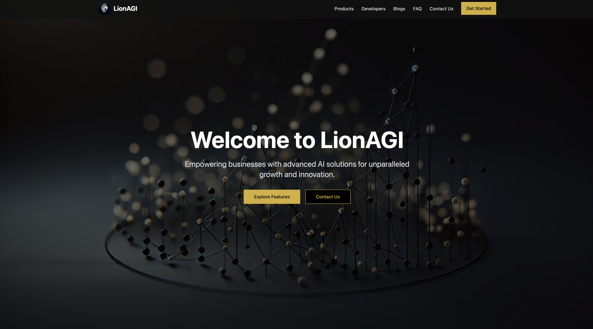

# LionAGI WebApp




## Table of Contents
1. [Introduction](#introduction)
2. [Features](#features)
3. [Prerequisites](#prerequisites)
4. [Installation](#installation)
5. [Usage](#usage)
6. [Project Structure](#project-structure)
7. [Technologies Used](#technologies-used)
8. [Contributing](#contributing)
9. [License](#license)
10. [Contact](#contact)

## Introduction

LionAGI WebApp is a cutting-edge platform designed to showcase and provide access to advanced AI solutions for businesses. Our platform offers a suite of powerful features for LLM (Large Language Model) orchestration, enabling efficient prompt engineering, model tuning, real-time inference, monitoring, governance, and scalability.

This web application serves as both an informational site and a portal for accessing LionAGI's services, allowing businesses to harness the power of AI to drive innovation and growth.


## Features

- **Prompt Engineering**: Advanced techniques for fine-tuning LLMs for specific tasks and use cases.
- **Model Tuning**: Easy fine-tuning of LLMs with custom datasets and hyperparameters.
- **Real-Time Inference**: Scalable infrastructure for low-latency, high-throughput inference.
- **Monitoring & Observability**: Comprehensive tools for gaining insights into LLM performance.
- **Governance & Security**: Robust access control and compliance features.
- **Scalability**: Seamless scaling to handle growing workloads and user demands.

## Prerequisites

Before you begin, ensure you have met the following requirements:

- Node.js (v14.0.0 or later)
- npm (v6.0.0 or later) or yarn (v1.22.0 or later)
- Git

## Installation

To install LionAGI WebApp, follow these steps:

1. Clone the repository:
   ```
   git clone https://github.com/your-organization/lionagi-webapp.git
   ```

2. Navigate to the project directory:
   ```
   cd lionagi-webapp
   ```

3. Install dependencies:
   ```
   npm install
   # or
   yarn install
   ```

4. Create a `.env.local` file in the root directory and add any necessary environment variables. For example:
   ```
   NEXT_PUBLIC_API_URL=https://api.lionagi.com
   ```

## Usage

To run the development server:

```
npm run dev
# or
yarn dev
```

Open [http://localhost:3000](http://localhost:3000) with your browser to see the result.

To build for production:

```
npm run build
# or
yarn build
```

To start the production server:

```
npm start
# or
yarn start
```

## Project Structure

```
lionagi-webapp/
├── components/
│   ├── layout/
│   ├── ui/
│   └── features/
├── pages/
│   ├── api/
│   ├── _app.tsx
│   └── index.tsx
├── public/
│   └── images/
├── styles/
├── lib/
├── utils/
├── .env.local
├── next.config.js
├── package.json
├── README.md
└── tsconfig.json
```

## Technologies Used

- [Next.js](https://nextjs.org/) - React framework for production
- [React](https://reactjs.org/) - JavaScript library for building user interfaces
- [TypeScript](https://www.typescriptlang.org/) - Typed superset of JavaScript
- [Tailwind CSS](https://tailwindcss.com/) - Utility-first CSS framework
- [Framer Motion](https://www.framer.com/motion/) - Animation library for React

## Contributing

We welcome contributions to the LionAGI WebApp! Please follow these steps to contribute:

1. Fork the repository
2. Create a new branch: `git checkout -b feature-branch-name`
3. Make your changes and commit them: `git commit -m 'Add some feature'`
4. Push to the branch: `git push origin feature-branch-name`
5. Submit a pull request

Please make sure to update tests as appropriate and adhere to the code style of the project.

## License

This project is licensed under the [MIT License](LICENSE).

## Contact

If you have any questions or feedback, please reach out to us at support@lionagi.com or visit our website at [https://www.lionagi.com](https://www.lionagi.com).

For bug reports and feature requests, please open an issue on our [GitHub repository](https://github.com/your-organization/lionagi-webapp/issues).